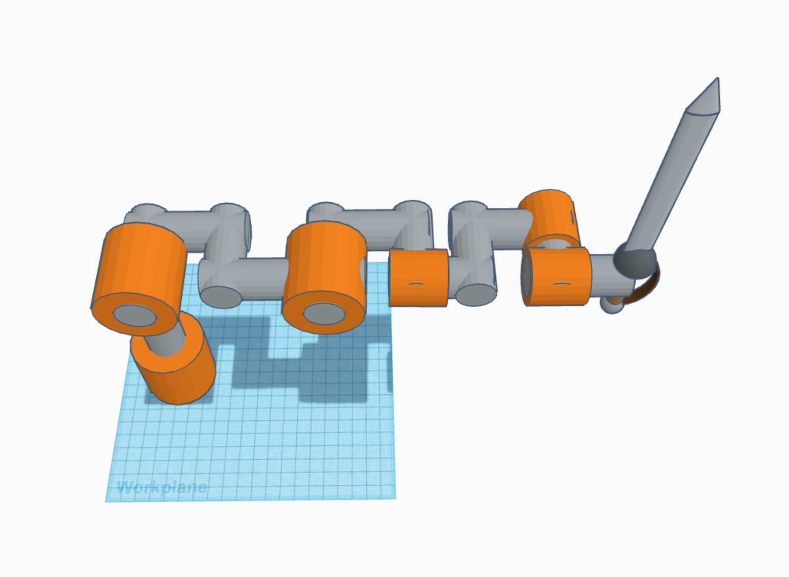
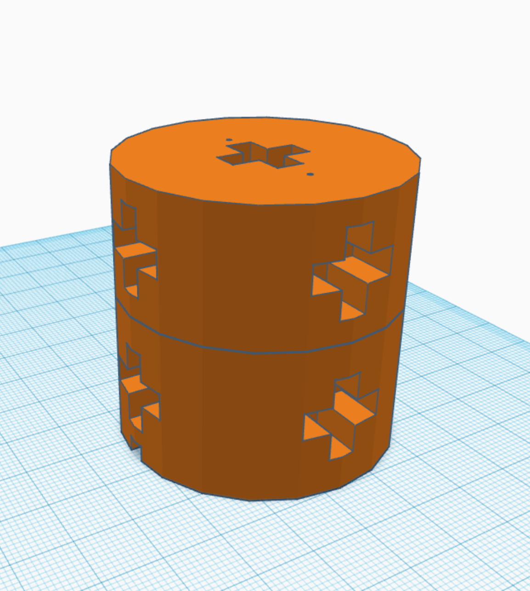
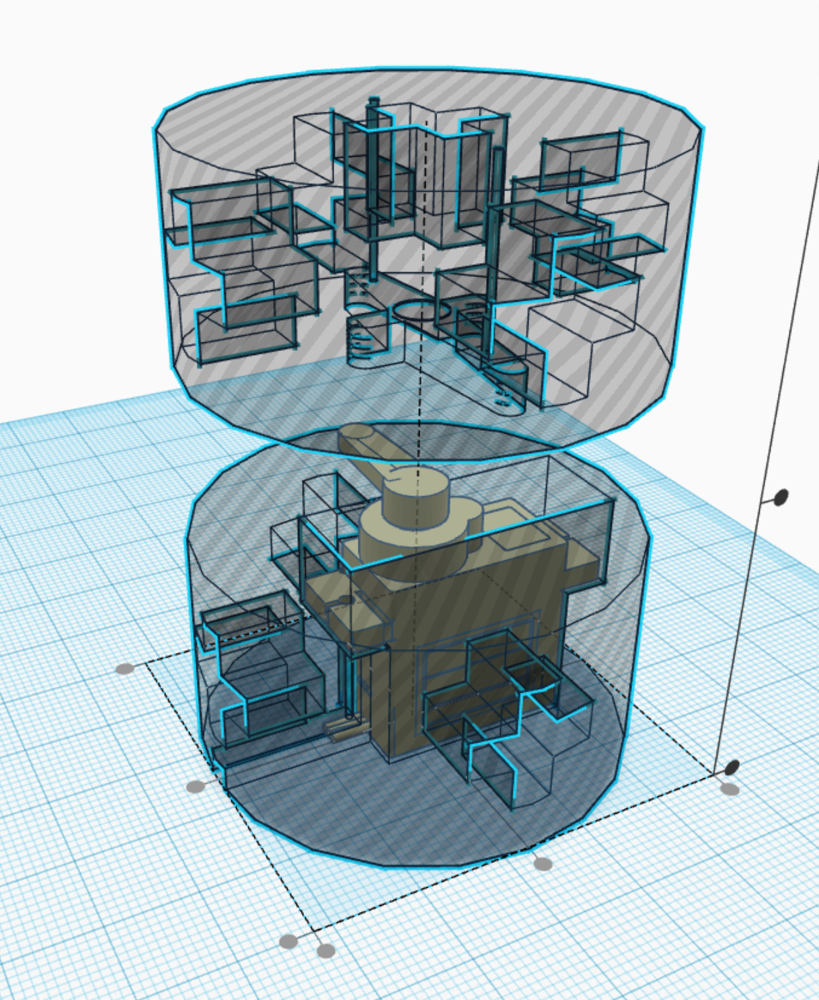
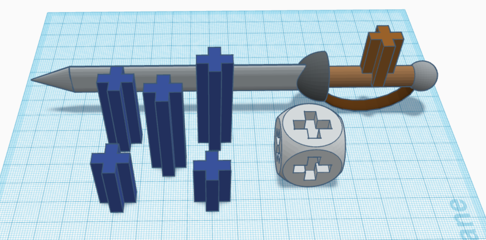
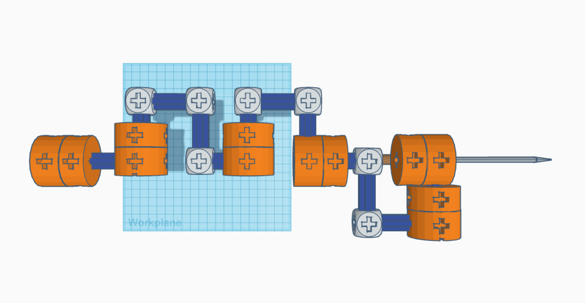

This package contains functions implementing forward kinematics, inverse kinematics, and rudimentary visualization. Usage descriptions and technical details follow.

# User Manual

## Overview
The kinematics.py code package contains three main functions, with a few variations:

- [forward_kinematics](###forard_kinematics())
- [inverse_kinematics](###inverse_kinematics())
- [visualization](###visualization)

Variations:

- [forward_kinematics_with_orientation](###forward_kinematics_with_orientation)

In each function, the arm parameters are pre-defined with the following lengths and home configurations.

Link lengths (arbitraty units):

- L1: 2
- L2: 4
- L3: 2
- L4: 3
- L5: 1.5
- L5_p: 1
- L6: 5

Home configuration DH table:

| link | theta | d     | a  | alpha |
| ---- | ----- | ----- | -- | ----- | 
| 1    | 0     | L1    | 0  | pi/2  |
| 2    | pi/2  | 0     | L2 | 0     |
| 3    | -pi/2 | 0     | 0  | -pi/2 |
| 4    | 0     | L3+L4 | 0  | pi/2  |
| 5    | -pi/2 | 0     | L5 | -pi/2 |
| 6    | pi    | L5_p  | L6 | 0     |

## Requirements

This kinematics code package requires the numpy and Open3d python packages, which can be installed with the following:

- http://www.open3d.org/docs/release/getting_started.html
- https://numpy.org/install/


## Usage
To use these functions, import the kinematics package into your Python script of choice. The `demo.py` script has been provided with test demos of each function.

```python
from kinematics import (forward_kinematics, 
                        forward_kinematics_with_orientation, 
                        inverse_kinematics, 
                        visualize_arm)
```

Call each function with the required (and optional) parameters descriped in the Documentation below.

For example:

```python
q1, q2, q3, q4, q5, q6 = pi, pi/2, 0, pi/4, pi/8, pi

points = forward_kinematics(q1, q2, q3, q4, q5, q6)
```


# Documentation

## forward_kinematics()

```python
forward_kinematics(q1, q2, q3, q4, q5, q6)
```

**Description**

Calculates the forward kinematics of the 6 DoF robot arm from a given set of joint angles and returns the positions of the joints and end effector as a list.

**Parameters**

- q1, q2, q3, q4, q5, q6 : *float*
  - Joint angles with respect to the home configuration (radians)

**Returns**

- points : *list*
  - List containing positions of joints and end effector


**Details**

The input joint angles are added to the pre-defined home configuration theta angles, and transformation matrices from each joint to the next are calculated, giving T0 -> T6.

Using the form:

```python
[cos(theta),   -cos(alpha)*sin(theta),   sin(alpha)*sin(theta),    a*cos(theta)],
[sin(theta),   cos(alpha)*cos(theta),    -sin(alpha)*cos(theta),   a*sin(theta)],
[0,            sin(alpha),               cos(alpha),               d           ],
[0,            0,                        0,                        1           ]
```

These transformation matrices are then consecutively matrix multiplied to create transformations from the origin from to each joint, all the way down to the end effector.

i.e. creating transformation matrices T0_1, T0_2, T0_3, T0_4, T0_5, T0_6.

Multiplying these matrices by the origin (0, 0, 0) calculates the position of each joint frame.

**Example**

```python
q1, q2, q3, q4, q5, q6 = pi, pi/2, 0, pi/4, pi/8, pi

points = forward_kinematics(q1, q2, q3, q4, q5, q6)
```

---

## inverse_kinematics()

```python
inverse_kinematics(T, err_tol=0.01, max_iter=100000, valid_err_thresh=1.0)
```

**Description**

Finds the joint angles that place the end effector at a given position and orientation, using the pseudo-inverse Jacobian with gradient descent. Returns `None` if no angles found.

**Parameters**

- T : *numpy.ndarray*
  - Transformation matrix describing the end effector position and orientation with respect to the origin frame. (i.e. `T0_6`)
- err_tol : *float (optional)*
  - Error tolerance for a solution to be considered correct. The error is calculated as the norm of the difference between the target transformation matrix and the calculated transformation matrix. Default value 0.01.
- max_iter : *int (optional)*
  - Max number of iterations to perform when attempting to find joint angles. Default value 100000.
- valid_err_thresh : *float (optional)*
  - Threshold to consider a solution valid if max_iter iterations are performed before a solution is found below the error tolerance. Default value 1.0.


**Returns**

- best_angles : *list or None*
  - List of angles placing end effector at given position and orientation, or `None` if no solution is found. Note: this does not return every possible combination of angles, only one set of angles that satisfies the position/orientation requirement.

**Details**

This function performs inverse kinematics using the pseudo-inverse Jacobian with gradient descent.

The following occurs in a loop, until either a target solution is found within the given error tolerance, or the max number of iterations is reached.

First, the transformation matrices relating each joint frame to the origin frame are found, starting with the arm's home configuration in the first loop iteration (i.e. ${}^0T_{1}$, ${}^0T_{2}$... ${}^0T_{6}$). Then, the Jacobian matrix is formed from these transformation matrices using the following formula for each column of the Jacobian matrix.

$$J_i(q) = [\frac{\hat{Z}_{i-1} \times (P_n - P_{i-1})}{\hat{Z}_{i-1}}]$$

Where $i$ is the index of the each joint starting from 1, $\hat{Z}_{i-1}$ is the first three rows of the third column of the ${}^0T_{i-1}$ transformation matrix, $P_n$ is the first three rows of the fourth column of the ${}^0T_{6}$ transformation matrix, and $P_{i-1}$ is the first three rows of the fourth column of the ${}^0T_{i-1}$ transformation matrix.

Once the Jacobian is formed, the pseudo-inverse is found using numpy's `numpy.linalg.pinv()` function.

The pseudo-inverse Jacobian is used to find an incremental change in joint angles in a direction that moves the end effector to the desired position/orientation, using:

$$\Delta \Theta = \alpha J^{\#} \Delta X $$

Where $\Delta \Theta$ is the change in joint angles, $\alpha$ is a scaling factor, $J^{\#}$ is the pseudo-inverse Jacobian, and $\Delta X$ is a 6x1 vector containing the end effector frame origin's linear velocity with respect to the world frame ($V_x, V_y, V_z$), and the end effector frame's angular velocity with respect to the world frame orientation ($\Omega_x, \Omega_y, \Omega_z$). Generally of the form:

$$ \Delta X = [V_x,\  V_y,\  V_z,\  \Omega_x,\  \Omega_y,\  \Omega_z]^T  $$

The linear velocities are found by calculating the distance between the end effector frame's current position (via ${}^0T_6$) and the target frame's position (via ${}^0T_{target}$). The angular velocities are found using the quaternion representation of the difference between the end effector frame's current orientation and the target frame's orientation. This is found by first computing the transformation matrix from the end effector to the target.

$${}^{6}T_{target} = {}^6T_0 {}^0T_{target}$$

The quaternion representation and angle velocities are then calculated using the following.

$$ q_w = \sqrt{1 + {}^{6}T_{target}[0,0] + {}^{6}T_{target}[1,1] + {}^{6}T_{target}[2,2]} $$
$$ q_x = \frac{{}^{6}T_{target}[2,1] - {}^{6}T_{target}[1,2]}{4q_w} $$
$$ q_y = \frac{{}^{6}T_{target}[0,2] - {}^{6}T_{target}[2,0]}{4q_w} $$
$$ q_z = \frac{{}^{6}T_{target}[1,0] - {}^{6}T_{target}[0,1]}{4q_w} $$

$$ \Omega_x = 2 \arcsin{q_x} $$
$$ \Omega_y = 2 \arcsin{q_y} $$
$$ \Omega_z = 2 \arcsin{q_z} $$

With the velocity vector $\Delta X$ and the pseudo-inverse jacobian $J^{\#}$, the incremental change in joint angles $\Delta \Theta$ is calculated from the equation above. These joint angles changes are used to compute new transformation matrices of each joint frame, effectively "moving" the end effector toward the desired position/orientation. The new end effector transformation (${}^0T_{6}$) is used to calculate the error between the new position/orientation and the target position/orientation using:

$$err = || {}^0T_{6} - {}^0T_{target} ||^2$$

If this error is lower than the defined tolerance, the current angles are considered a valid solution and are returned. Otherwise, the loop is repeated.


**Example**

```python
T_target = np.array([[0.78834994, 0.25530932, 0.55975131,  3.94934469],
                    [0.23199901,  0.71929276, -0.65482394, 1.18015784],
                    [-0.56980772, 0.64609216, 0.50782289,  1.11017123],
                    [0,           0,          0,           1]], dtype='float')

angles = inverse_kinematics(T_target)

if not angles:
    print("ERROR: no angles found for target T matrix\n{}".format(T_target))
    exit()
```
---


## visualize_arm()

```python
visualize_arm(T_matrices, T_verify=None)
```

**Description**

Visualizes the 6 DoF arm in a simple stick-figure-like representation using the transformation matrices given in `T_matrices`. Optionally visualizes a second arm overlayed on the first for verification purposes (used to verify the [inverse_kinematics](###inverse_kinematics()) function).

NOTE: the last will always be at an angle from the second to last frame, because the second to last link of the arm contains a 90 degree bend. The last frame shows the correct orientation.

The origin frame is connected to two lines, which represent the positive direction of the x and y axes of the world frame.

**Parameters**

- T_matrices : *list*
  - A list of transformation matrices from the world frame to the end effector frame. Should be of the form:
    - $[ {}^0T_{1}, {}^0T_{2}, {}^0T_{3}, {}^0T_{4}, {}^0T_{5}, {}^0T_{6} ]$
- T_verify : *list (optional)*
  - A list of transformation matrices from the world frame to the end effector frame. Should be of the form described above.

**Details**

This function uses Open3d to visualize the 6 DoF robot arm. The links are represented by straight lines, while the link frame position/orientation is represented by R,G,B frame meshes, where red is x, G is y, and B is z.

**Example**

```python
visualize_arm([T0_1, T0_2, T0_3, T0_4, T0_5, T0_6])
```

---

## forward_kinematics_with_orientation()

```python
forward_kinematics_with_orientation(q1, q2, q3, q4, q5, q6)
```

**Description**

Contains the same logic as [forward_kinematics](###forward_kinematics()), but returns the transformation matrices for orientation representation.

Calculates the forward kinematics of the 6 DoF robot arm from a given set of joint angles and returns the positions of the joints and end effector as a list.

**Parameters**

- q1, q2, q3, q4, q5, q6 : *float*
  - Joint angles with respect to the home configuration (radians)

**Returns**

- points : *list*
  - List containing positions of joints and end effector
- T0_1, T0_2, T0_3, T0_4, T0_5, T0_6 : *numpy.ndarray*
  - Transformation matrices from the origin frame to each link frame


**Details**

See [forward_kinematics](###forward_kinematics()) for details regarding logic.

**Example**

```python
q1, q2, q3, q4, q5, q6 = pi, pi/2, 0, pi/4, pi/8, pi

points, T0_1, T0_2, T0_3, T0_4, T0_5, T0_6 = forward_kinematics_with_orientation(q1,
                                                                                 q2,
                                                                                 q3,
                                                                                 q4,
                                                                                 q5,
                                                                                 q6)
```


# Hardware Prototype

## Approach
As both of us are Computer Engineering majors, we utilized our skillsets to design and create a physical prototype of a 6R orthogonal manipulator. We decided to focus on achieving affordability, and accuracy to project's subject arm.
So, we utilized 3D printing (FDM) for cost-effectiveness and lightweight construction. This, integrated with common micro servos and an arm microcontroller created the baseline for our prototype.Then we built a comprehensive C++ code package for driving robot manipulators, emphasizing custom classes for matrix mathematics, and servo PWM controllers.

## Design

### Orthogonal Joints
With accuracy to the original arm in mind, we started with a mockup of a generic 6R manipulator structure that allows for joint to be along a single axis


### Modular Structure
Given that 3D-printing allows for "free" complexity, in designing the joints we used a modular design that allows for links to be easily attached from various points on each side of a revolute joint. This took inspiration from the professor's use of "tinker toys" in teaching rotations to the class.
  |  


### Final Model
We then assembled these joints, links, and connectors into the shape of the arm for the project.



## Code

### Matrix.h
This templated class allows for the creation and manipulation of dynamic matrices of any size. It implements common operators such as Matrix.Transpose() and Matrix.Multiply()

### Servo.h
This class interfaces with our microcontroller to generate PWM control signals for a connected digital servo. It allows for calibration, home angles, and precise real-time control.

### Manipulator.h & Joint.h
Serving as the implementation of the theory presented in this course, this class closely models the links of a robotic arm according to the standard DH convention. Links may be dynamically added with desired joint parameters, and then transformation matrices can be calculated from any frame.

## Results
Due to inconsistencies in 3D-printing and the small amount of torque supplied by micro servos, our design may improved going forward. However, with the limited time of this project, our prototype has proven to be a valuable lessen in the application of the robotics theory presented in our coursework. Further, our prototype's modular design and afforable material selection, contribute to the project's success in not just modeling the given arm for this project, but many other future manipulators with minimal effort. 

## References

Stefan Schaal, *Jacobian methods for inverse kinematics and planning*

- https://homes.cs.washington.edu/~todorov/courses/cseP590/06_JacobianMethods.pdf

Steve Rotenberg, *Inverse Kinematics*

- https://cseweb.ucsd.edu/classes/sp16/cse169-a/slides/CSE169_09.pdf

Samuel R. Buss, *Introduction to Inverse Kinematics with Jacobian Transpose, Pseudoinverse, and Damped Least Squares methods*

- https://mathweb.ucsd.edu/~sbuss/ResearchWeb/ikmethods/iksurvey.pdf


